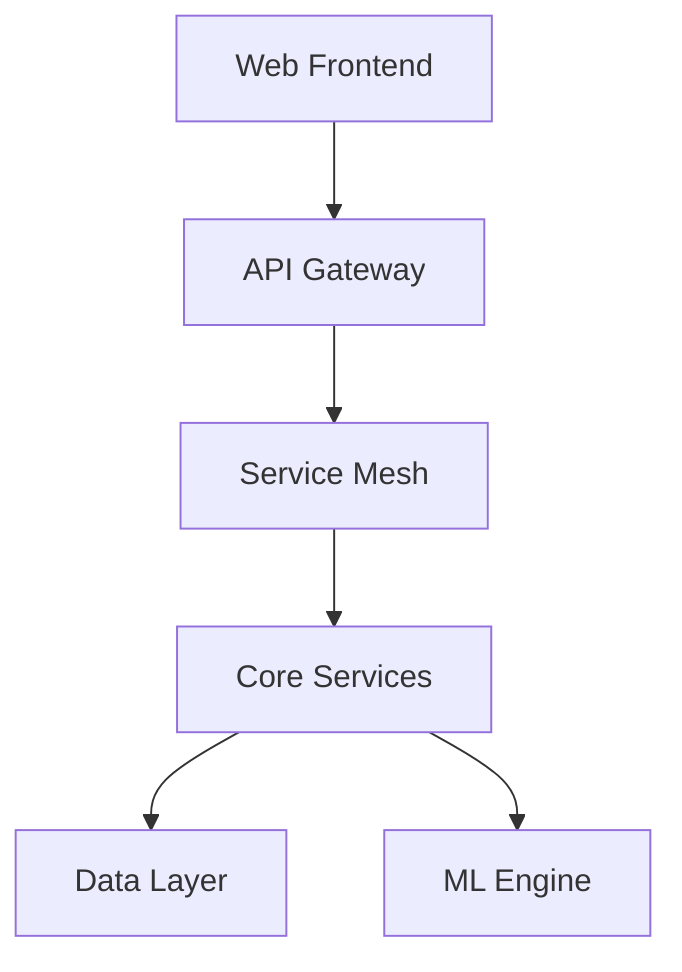

# Bookman AI Agent

[](https://github.com/bookman/actions)
[](https://github.com/bookman/security)
[](https://opensource.org/licenses/MIT)

> Bookman AI Agent is a comprehensive cryptocurrency education and investment platform powered by artificial intelligence. The platform democratizes access to crypto knowledge and empowers users of all experience levels through personalized learning paths, real-time market analysis, and automated security features.

## Features

- **AI-Driven Education**
  - Personalized learning paths tailored to user knowledge level
  - Interactive tutorials with real-time feedback
  - Progress tracking and achievement system
  - AI-generated content updates based on market trends

- **Market Intelligence**
  - Real-time market analysis using machine learning
  - Predictive analytics for trend identification
  - Risk assessment and portfolio optimization
  - Automated market sentiment analysis

- **Security & Protection**
  - Automated fraud detection system
  - Smart contract security analysis
  - Real-time security alerts
  - Best practices enforcement

- **Portfolio Management**
  - Multi-wallet integration
  - Performance analytics
  - Asset allocation optimization
  - Historical tracking and reporting

- **Community & Social**
  - Expert interaction platform
  - Knowledge sharing marketplace
  - Social learning features
  - Token-based reward system

## Architecture Overview



## Prerequisites

- **Node.js** (v18.0.0+)
- **Python** (v3.11+)
- **Go** (v1.21+)
- **Rust** (v1.70+)
- **Docker** (v24.0+)
- **PostgreSQL** (v15+)
- **Redis** (v7.0+)

## Quick Start

1. **Clone the repository**
```bash
git clone --recursive https://github.com/bookman/bookman-ai-agent.git
cd bookman-ai-agent
```

2. **Set up environment variables**
```bash
cp .env.example .env
# Edit .env with your configuration
```

3. **Install dependencies**
```bash
# Frontend
cd src/web
npm install

# Backend
cd src/backend
pip install -r requirements.txt
go mod download
cargo build
```

4. **Start development environment**
```bash
docker-compose up -d
```

5. **Access the application**
```
Frontend: http://localhost:3000
API Docs: http://localhost:8000/docs
```

## Development

### Local Development Setup

The project uses Docker Compose for local development. Key services:

- Frontend (React): Port 3000
- API Gateway (Kong): Port 8000
- Core Services: Ports 8001-8010
- Database: Port 5432
- Redis: Port 6379

### Testing

```bash
# Run frontend tests
cd src/web
npm test

# Run backend tests
cd src/backend
pytest
go test ./...
cargo test
```

### Documentation

- API Documentation: `/docs/api`
- Component Storybook: `/docs/storybook`
- Architecture Guide: `/docs/architecture`
- Integration Guide: `/docs/integration`

## Contributing

Please read [CONTRIBUTING.md](CONTRIBUTING.md) for details on our code of conduct and the process for submitting pull requests.

### Development Workflow

1. Fork the repository
2. Create a feature branch
3. Commit your changes
4. Push to your fork
5. Submit a pull request

## Security

For security concerns, please refer to our [Security Policy](SECURITY.md). For reporting vulnerabilities, please use our responsible disclosure process detailed in the security documentation.

## License

This project is licensed under the MIT License - see the [LICENSE](LICENSE) file for details.

## Support

- Documentation: [docs.bookman.ai](https://docs.bookman.ai)
- Issues: [GitHub Issues](https://github.com/bookman/issues)
- Community: [Discord](https://discord.gg/bookman)
- Email: support@bookman.ai

---

**Note:** This project is under active development. For the latest updates, please watch our repository and join our community channels.