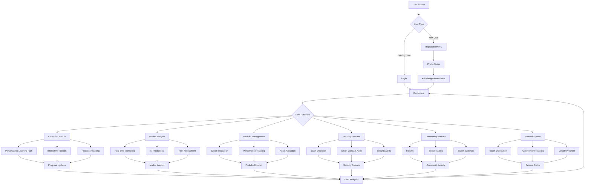
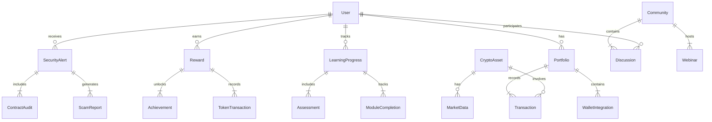
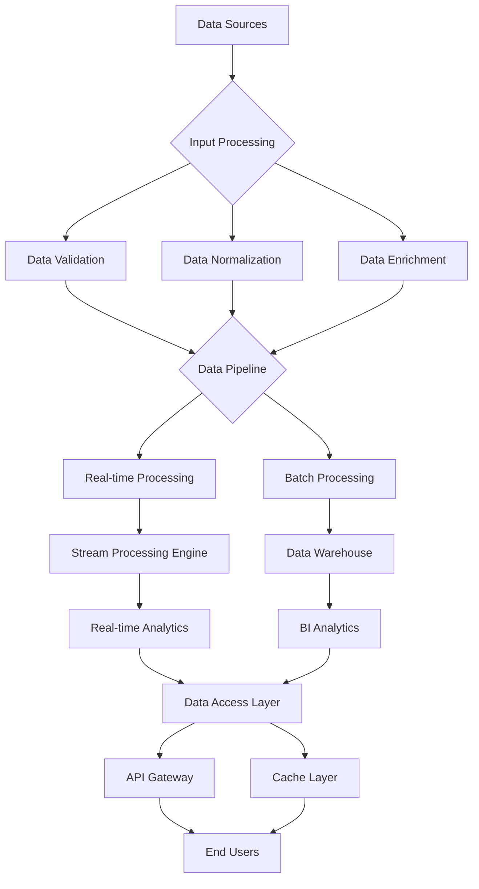
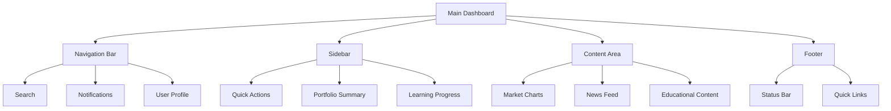
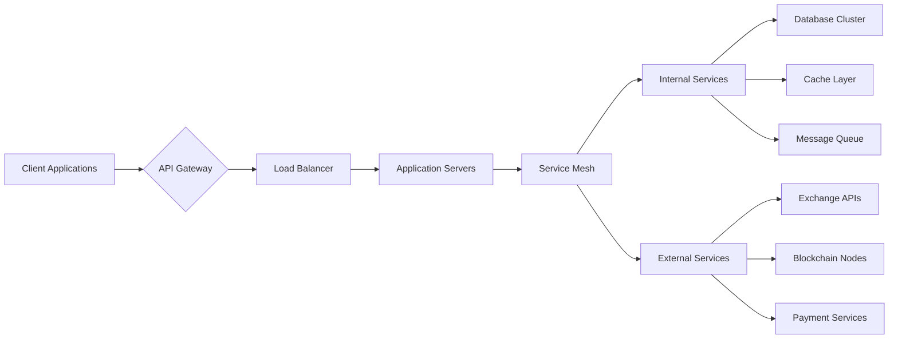

# Product Requirements Document (PRD)

# 1. INTRODUCTION

## 1.1 Purpose
This Software Requirements Specification (SRS) document provides a comprehensive description of the Bookman AI Agent platform. It details the functional and non-functional requirements for developers, project managers, QA teams, and stakeholders involved in the development and deployment of the system. This document will serve as the authoritative reference for technical implementation and validation of the platform's features.

## 1.2 Scope
Bookman AI Agent is an educational and analytical platform designed to democratize cryptocurrency knowledge and investment strategies. The system encompasses:

- Personalized AI-driven learning modules for cryptocurrency education
- Real-time market analysis and investment insights
- Portfolio tracking and management tools
- Automated fraud detection and security alerts
- Community engagement features and social learning capabilities
- Gamified reward system with token-based incentives
- 24/7 AI assistant for user support and queries

Key benefits include:
- Reduced learning curve for crypto newcomers
- Enhanced investment decision-making through AI-powered insights
- Improved portfolio management and risk assessment
- Protection against crypto-related fraud and scams
- Increased user engagement through community features and rewards
- Accessible crypto education through natural language interaction

The platform will be developed as a web-based application with mobile responsiveness, integrating various cryptocurrency APIs and blockchain networks for real-time data processing and analysis.

# 2. PRODUCT DESCRIPTION

## 2.1 Product Perspective
Bookman AI Agent operates as a standalone web-based platform that integrates with multiple external systems and services:

- Cryptocurrency exchanges and market data providers for real-time pricing and trading information
- Blockchain networks for transaction verification and wallet monitoring
- Cloud-based AI/ML services for market analysis and educational content personalization
- External authentication systems for secure user access
- Payment gateways for premium feature transactions
- Social media platforms for community engagement features

## 2.2 Product Functions
The platform provides the following core functions:

1. Educational System
   - Personalized learning paths based on user knowledge level
   - Interactive tutorials and quizzes
   - Progress tracking and assessment
   - Real-world case studies and examples

2. Market Analysis
   - Real-time cryptocurrency price monitoring
   - Trend analysis and pattern recognition
   - Price prediction models
   - Risk assessment tools

3. Portfolio Management
   - Multi-wallet integration
   - Performance tracking and reporting
   - Asset allocation recommendations
   - Transaction history and tax reporting

4. Security Features
   - Automated scam detection
   - Smart contract audit tools
   - Suspicious activity alerts
   - Security best practices guidance

5. Community Platform
   - Discussion forums
   - Peer-to-peer learning
   - Expert webinars
   - Social trading features

6. Reward System
   - Achievement-based token distribution
   - Learning milestone rewards
   - Community contribution incentives
   - Loyalty program features

## 2.3 User Characteristics
The platform caters to three primary user personas:

1. Crypto Novices
   - Limited technical knowledge
   - Focus on basic education and safety
   - Need clear, simple explanations
   - Prefer guided experiences

2. Intermediate Investors
   - Basic understanding of cryptocurrency
   - Interest in portfolio diversification
   - Need advanced trading strategies
   - Value community insights

3. Advanced Traders
   - Deep technical knowledge
   - Focus on advanced analysis tools
   - Need real-time data and alerts
   - Contribute to community knowledge

## 2.4 Constraints
1. Technical Constraints
   - Must maintain real-time data synchronization
   - API rate limits from external services
   - Cross-browser compatibility requirements
   - Mobile responsiveness requirements

2. Regulatory Constraints
   - Compliance with financial regulations
   - Data protection and privacy laws
   - KYC/AML requirements
   - Regional trading restrictions

3. Business Constraints
   - Market volatility impact on analysis accuracy
   - Scalability requirements for user growth
   - Competition with existing platforms
   - Resource allocation limitations

## 2.5 Assumptions and Dependencies
Assumptions:
- Users have basic internet connectivity
- Cryptocurrency markets remain accessible
- Blockchain networks maintain operational status
- AI/ML models can be effectively trained on crypto data
- User base grows according to projections

Dependencies:
- Third-party API availability and reliability
- Blockchain network stability
- Cloud service provider uptime
- External data feed accuracy
- Community participation levels
- Regulatory environment stability

# 3. PROCESS FLOWCHART

# 4. FUNCTIONAL REQUIREMENTS

## 4.1 Educational System

### ID: EDU-001
### Description
AI-driven personalized learning system that adapts content and difficulty based on user progress and knowledge level.
### Priority: High
### Requirements

| ID | Requirement | Description | Priority |
|---|-------------|-------------|-----------|
| EDU-001.1 | Knowledge Assessment | Initial evaluation to determine user's crypto knowledge level | High |
| EDU-001.2 | Custom Learning Paths | Generate personalized curriculum based on assessment results | High |
| EDU-001.3 | Interactive Tutorials | Multimedia lessons with quizzes and practical exercises | Medium |
| EDU-001.4 | Progress Tracking | Monitor and display user advancement through learning modules | Medium |
| EDU-001.5 | Content Generation | AI-powered creation of educational content and examples | High |

## 4.2 Market Analysis

### ID: MKT-001
### Description
Real-time cryptocurrency market analysis system with AI-powered predictions and insights.
### Priority: High
### Requirements

| ID | Requirement | Description | Priority |
|---|-------------|-------------|-----------|
| MKT-001.1 | Price Monitoring | Real-time tracking of cryptocurrency prices across exchanges | High |
| MKT-001.2 | Trend Analysis | AI-based pattern recognition and trend identification | High |
| MKT-001.3 | Risk Assessment | Automated evaluation of investment risks and market conditions | Medium |
| MKT-001.4 | Price Predictions | Machine learning models for price movement forecasting | Medium |
| MKT-001.5 | Market Alerts | Customizable notifications for price movements and trends | High |

## 4.3 Portfolio Management

### ID: PRT-001
### Description
Comprehensive portfolio tracking and management system with multi-wallet integration.
### Priority: High
### Requirements

| ID | Requirement | Description | Priority |
|---|-------------|-------------|-----------|
| PRT-001.1 | Wallet Integration | Support for multiple cryptocurrency wallets and exchanges | High |
| PRT-001.2 | Performance Analytics | Track and analyze portfolio performance metrics | High |
| PRT-001.3 | Asset Allocation | Recommendations for portfolio diversification | Medium |
| PRT-001.4 | Transaction History | Detailed record of all cryptocurrency transactions | Medium |
| PRT-001.5 | Tax Reporting | Generate tax reports for cryptocurrency transactions | Low |

## 4.4 Security Features

### ID: SEC-001
### Description
Automated security system for fraud detection and smart contract analysis.
### Priority: Critical
### Requirements

| ID | Requirement | Description | Priority |
|---|-------------|-------------|-----------|
| SEC-001.1 | Scam Detection | AI-powered identification of fraudulent projects and tokens | Critical |
| SEC-001.2 | Smart Contract Audit | Automated analysis of smart contract vulnerabilities | High |
| SEC-001.3 | Security Alerts | Real-time notifications of suspicious activities | Critical |
| SEC-001.4 | Best Practices | Security guidelines and recommendations | Medium |
| SEC-001.5 | Threat Monitoring | Continuous scanning for emerging security threats | High |

## 4.5 Community Platform

### ID: COM-001
### Description
Social learning and community engagement system with integrated rewards.
### Priority: Medium
### Requirements

| ID | Requirement | Description | Priority |
|---|-------------|-------------|-----------|
| COM-001.1 | Discussion Forums | Threaded discussions for community interaction | Medium |
| COM-001.2 | Social Trading | Ability to share and follow trading strategies | Medium |
| COM-001.3 | Expert Webinars | Live educational sessions with industry experts | Low |
| COM-001.4 | Peer Learning | User-to-user knowledge sharing features | Medium |
| COM-001.5 | Content Moderation | AI-assisted moderation of community content | High |

## 4.6 Reward System

### ID: REW-001
### Description
Token-based incentive system for platform engagement and learning achievements.
### Priority: Medium
### Requirements

| ID | Requirement | Description | Priority |
|---|-------------|-------------|-----------|
| REW-001.1 | Token Distribution | Automated reward distribution for completed activities | High |
| REW-001.2 | Achievement System | Tracking and rewarding user milestones | Medium |
| REW-001.3 | Loyalty Program | Long-term engagement rewards and benefits | Low |
| REW-001.4 | Reward History | Track and display user's earned rewards | Medium |
| REW-001.5 | Token Economy | Management of platform token supply and distribution | High |

# 5. NON-FUNCTIONAL REQUIREMENTS

## 5.1 Performance Requirements

| Requirement | Description | Target Metric |
|-------------|-------------|---------------|
| Response Time | Maximum time for page loads and API responses | < 2 seconds |
| Real-time Data Latency | Delay in market data updates | < 500ms |
| API Throughput | Number of concurrent API requests handled | 1000 requests/second |
| Database Performance | Query response time | < 100ms |
| Resource Usage | Maximum server CPU utilization | < 70% |
| Mobile Performance | Page load time on mobile devices | < 3 seconds |
| WebSocket Connections | Maximum concurrent real-time connections | 10,000 |

## 5.2 Safety Requirements

| Requirement | Description | Implementation |
|-------------|-------------|----------------|
| Data Backup | Regular automated backups of all user data | Every 6 hours |
| Disaster Recovery | System recovery time objective (RTO) | < 4 hours |
| Failover Systems | Automatic switching to backup systems | < 1 minute |
| Data Loss Prevention | Recovery point objective (RPO) | < 15 minutes |
| System Monitoring | Continuous monitoring of critical components | 24/7 monitoring |
| Error Handling | Graceful degradation of services | Fallback mechanisms |
| Transaction Safety | Atomic operations for financial transactions | Two-phase commit |

## 5.3 Security Requirements

| Requirement | Description | Standard |
|-------------|-------------|-----------|
| Authentication | Multi-factor authentication | NIST 800-63B |
| Authorization | Role-based access control (RBAC) | OAuth 2.0 |
| Data Encryption | End-to-end encryption for sensitive data | AES-256 |
| API Security | API key management and rate limiting | JWT tokens |
| Session Management | Secure session handling | OWASP standards |
| Penetration Testing | Regular security assessments | Quarterly |
| Audit Logging | Comprehensive security event logging | ISO 27001 |

## 5.4 Quality Requirements

### 5.4.1 Availability
- System uptime: 99.9% (excluding planned maintenance)
- Maximum planned downtime: 4 hours/month
- Unplanned downtime recovery: < 1 hour

### 5.4.2 Maintainability
- Code documentation coverage: > 80%
- Automated test coverage: > 90%
- Deployment frequency: Weekly releases
- Hot-fix deployment time: < 2 hours

### 5.4.3 Usability
- First-time user task completion rate: > 80%
- User error rate: < 5%
- Help documentation accessibility: 24/7
- Mobile device compatibility: iOS 13+, Android 8+

### 5.4.4 Scalability
- Horizontal scaling capability: Auto-scaling
- Maximum users supported: 1 million concurrent
- Data storage scalability: Petabyte-scale
- Load balancing: Automatic distribution

### 5.4.5 Reliability
- Mean time between failures (MTBF): > 720 hours
- Mean time to repair (MTTR): < 2 hours
- Error rate: < 0.1%
- Data accuracy: 99.99%

## 5.5 Compliance Requirements

| Requirement | Description | Standard |
|-------------|-------------|-----------|
| Data Protection | User data privacy and protection | GDPR, CCPA |
| Financial Services | Cryptocurrency trading regulations | FinCEN, SEC guidelines |
| Security Standards | Information security management | ISO 27001 |
| Accessibility | Web content accessibility | WCAG 2.1 Level AA |
| KYC/AML | User verification and monitoring | BSA requirements |
| Data Retention | Data storage and deletion policies | Regional requirements |
| API Standards | RESTful API design and documentation | OpenAPI 3.0 |

# 6. DATA REQUIREMENTS

## 6.1 Data Models

## 6.2 Data Storage

### 6.2.1 Primary Storage Systems
| Data Type | Storage System | Retention Period | Backup Frequency |
|-----------|----------------|------------------|------------------|
| User Data | PostgreSQL | 7 years | Every 6 hours |
| Market Data | TimescaleDB | 2 years | Daily |
| Analytics Data | ClickHouse | 1 year | Daily |
| Session Data | Redis | 24 hours | Real-time replication |
| Media Files | Object Storage | 5 years | Weekly |
| Blockchain Data | MongoDB | Indefinite | Daily |

### 6.2.2 Backup and Recovery
| Component | Strategy | Recovery Time Objective | Recovery Point Objective |
|-----------|----------|------------------------|-------------------------|
| User Data | Multi-region replication | 1 hour | 15 minutes |
| Market Data | Hot-standby replicas | 5 minutes | 1 minute |
| Analytics | Incremental backups | 4 hours | 1 hour |
| Blockchain | Full node synchronization | 12 hours | Real-time |

## 6.3 Data Processing

### 6.3.1 Data Security Controls
| Layer | Security Measure | Implementation |
|-------|-----------------|----------------|
| Transport | TLS 1.3 | All data in transit |
| Storage | AES-256 | All data at rest |
| Application | Field-level encryption | PII and financial data |
| Access | Row-level security | Multi-tenant data isolation |
| Audit | Change data capture | All data modifications |

### 6.3.2 Data Processing Requirements
| Process Type | Latency Requirement | Throughput Requirement |
|--------------|---------------------|----------------------|
| Market Data Ingestion | < 100ms | 10,000 events/second |
| User Transactions | < 500ms | 1,000 TPS |
| Analytics Processing | < 5 minutes | 100 GB/hour |
| ML Model Training | < 24 hours | 1 TB/day |
| Content Generation | < 1 second | 100 requests/second |

### 6.3.3 Data Quality Requirements
| Metric | Target | Monitoring |
|--------|--------|------------|
| Completeness | 99.9% | Real-time validation |
| Accuracy | 99.99% | Automated testing |
| Consistency | 100% | Schema enforcement |
| Timeliness | < 1 second | Latency tracking |
| Integrity | 100% | Checksums and validation |

# 7. EXTERNAL INTERFACES

## 7.1 User Interfaces

### 7.1.1 Web Application Interface
| Component | Requirements |
|-----------|--------------|
| Responsive Design | Bootstrap 5.0+ framework with mobile-first approach |
| Browser Support | Chrome 90+, Firefox 88+, Safari 14+, Edge 90+ |
| Screen Resolutions | 320px to 4K (3840px) with fluid layouts |
| Accessibility | WCAG 2.1 Level AA compliance |
| Theme Support | Light/Dark mode with customizable color schemes |

### 7.1.2 Mobile Responsiveness
| Breakpoint | Design Requirements |
|------------|-------------------|
| Small (≤576px) | Single column layout, collapsible menus |
| Medium (≤768px) | Two column layout, simplified charts |
| Large (≤992px) | Multi-column layout, full feature set |
| Extra Large (≤1200px) | Optimized desktop experience |

### 7.1.3 UI Components

## 7.2 Hardware Interfaces

### 7.2.1 Server Infrastructure
| Component | Specification |
|-----------|--------------|
| Load Balancers | AWS Application Load Balancer |
| Compute Resources | AWS EC2 Auto Scaling Groups |
| Storage Systems | AWS EBS, S3 for object storage |
| Cache Layer | AWS ElastiCache (Redis) |
| CDN | AWS CloudFront |

### 7.2.2 Client Requirements
| Device Type | Minimum Requirements |
|-------------|---------------------|
| Desktop | 2GB RAM, Modern CPU, HTML5 capable browser |
| Mobile | iOS 13+ or Android 8+, 1GB RAM |
| Tablet | iOS 13+ or Android 8+, 2GB RAM |

## 7.3 Software Interfaces

### 7.3.1 External APIs
| Service | Interface Type | Protocol | Data Format |
|---------|---------------|----------|-------------|
| Cryptocurrency Exchanges | REST API | HTTPS | JSON |
| Blockchain Networks | RPC/WebSocket | WSS/HTTPS | JSON-RPC |
| Market Data Providers | REST/WebSocket | HTTPS/WSS | JSON |
| Payment Processors | REST API | HTTPS | JSON |
| Authentication Services | OAuth 2.0 | HTTPS | JWT |

### 7.3.2 Internal Services
| Service | Purpose | Protocol | Format |
|---------|----------|----------|---------|
| AI/ML Engine | Analysis & Predictions | gRPC | Protocol Buffers |
| Content Management | Educational Content | REST | JSON |
| User Management | Account Services | REST | JSON |
| Analytics Engine | Data Processing | Apache Kafka | Avro |

## 7.4 Communication Interfaces

### 7.4.1 Network Protocols
| Protocol | Usage | Security |
|----------|--------|----------|
| HTTPS | REST API communication | TLS 1.3 |
| WSS | Real-time data streaming | TLS 1.3 |
| gRPC | Internal service communication | mTLS |
| MQTT | IoT device communication | TLS 1.2+ |

### 7.4.2 Data Exchange Formats
| Format | Use Case | Validation |
|--------|----------|------------|
| JSON | API responses | JSON Schema |
| Protocol Buffers | Service communication | Proto3 schema |
| Avro | Stream processing | Avro schema |
| JWT | Authentication tokens | RS256 signing |

### 7.4.3 Integration Points

# 8. APPENDICES

## 8.1 GLOSSARY

| Term | Definition |
|------|------------|
| Blockchain | A distributed, immutable ledger technology that records transactions across a network of computers |
| Smart Contract | Self-executing contracts with terms directly written into code |
| Tokenomics | The economics of cryptocurrency tokens, including supply, distribution, and incentives |
| DeFi | Decentralized Finance - financial services built on blockchain technology |
| Wallet | Digital storage for cryptocurrency assets and private keys |
| KYC | Know Your Customer - process of verifying user identity |
| AML | Anti-Money Laundering - regulations to prevent illegal financial activities |
| NFT | Non-Fungible Token - unique digital assets on blockchain |
| DEX | Decentralized Exchange - peer-to-peer cryptocurrency exchange |
| Gas Fee | Transaction fee for blockchain operations |

## 8.2 ACRONYMS

| Acronym | Full Form |
|---------|-----------|
| API | Application Programming Interface |
| AWS | Amazon Web Services |
| BI | Business Intelligence |
| BSA | Bank Secrecy Act |
| CCPA | California Consumer Privacy Act |
| CDN | Content Delivery Network |
| CPU | Central Processing Unit |
| GDPR | General Data Protection Regulation |
| JWT | JSON Web Token |
| ML | Machine Learning |
| MTBF | Mean Time Between Failures |
| MTTR | Mean Time To Repair |
| NIST | National Institute of Standards and Technology |
| OAuth | Open Authorization |
| PII | Personally Identifiable Information |
| RBAC | Role-Based Access Control |
| REST | Representational State Transfer |
| RPO | Recovery Point Objective |
| RTO | Recovery Time Objective |
| SEC | Securities and Exchange Commission |
| TLS | Transport Layer Security |
| TPS | Transactions Per Second |
| UI | User Interface |
| WCAG | Web Content Accessibility Guidelines |
| WSS | WebSocket Secure |

## 8.3 ADDITIONAL REFERENCES

| Category | Reference | Description |
|----------|-----------|-------------|
| Security Standards | OWASP Top 10 | Web application security risks and prevention |
| API Design | OpenAPI Specification | REST API documentation standard |
| Blockchain | Bitcoin Whitepaper | Original cryptocurrency concept paper |
| Compliance | FinCEN Guidelines | Financial regulatory compliance documentation |
| Development | React Documentation | Frontend framework documentation |
| Infrastructure | AWS Architecture | Cloud infrastructure best practices |
| AI/ML | TensorFlow Documentation | Machine learning framework documentation |
| Testing | Jest Documentation | JavaScript testing framework |
| Database | PostgreSQL Manual | Primary database documentation |
| Monitoring | Prometheus Documentation | System monitoring and alerting |