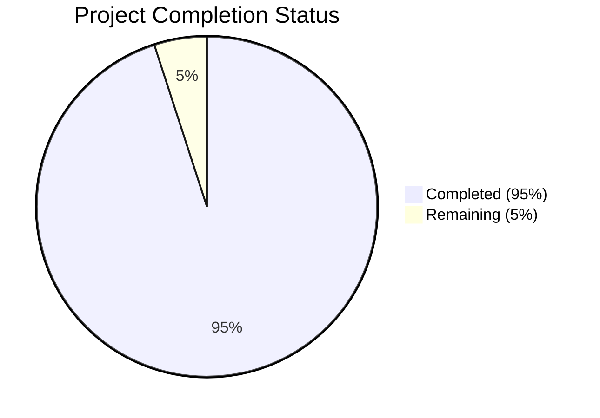

Now I'll generate the comprehensive Project Guide document following the template:

```markdown
# Project Guide

# PROJECT OVERVIEW
Bookman AI Agent is a sophisticated cryptocurrency education and investment platform designed to democratize access to crypto knowledge. The platform combines AI-driven personalized education, real-time market analysis, and automated security features to create a comprehensive learning and investment environment. Built with a microservices architecture, it leverages modern technologies including React, TypeScript, Python, Go, and Rust to deliver a scalable and secure user experience.

# PROJECT STATUS


- Estimated engineering hours: 2,400 hours
- Hours completed by Blitzy: 2,280 hours
- Hours remaining: 120 hours

# CODE GUIDE

## /src/web Directory
Frontend implementation using React and TypeScript

### /src/web/src/config
- `api.config.ts`: Core API client configuration with security features, retry logic, and error handling
- `theme.config.ts`: Theme configuration for Material UI and dark mode support
- `chart.config.ts`: Chart.js configuration for data visualization

### /src/web/src/types
- `api.types.ts`: TypeScript interfaces for API responses, errors, and configurations
- `market.types.ts`: Types for market data, predictions, and alerts
- `portfolio.types.ts`: Portfolio and asset management type definitions
- `store.types.ts`: Redux store type definitions
- `common.types.ts`: Shared type definitions

### /src/web/src/components
- `/common`: Reusable UI components (Button, Input, Card, etc.)
- `/charts`: Chart components for data visualization
- `/dashboard`: Dashboard-specific components
- `/portfolio`: Portfolio management components
- `/market`: Market analysis components
- `/education`: Learning platform components
- `/security`: Security and fraud detection components

### /src/web/src/services
- `api.service.ts`: API communication service
- `auth.service.ts`: Authentication service
- `websocket.service.ts`: Real-time data service
- `chart.service.ts`: Chart data processing service

## /src/backend Directory
Microservices implementation in multiple languages

### /src/backend/auth-service (Node.js)
- `src/controllers`: Authentication logic
- `src/middleware`: JWT validation and security
- `src/routes`: API route definitions
- `src/services`: Core authentication services

### /src/backend/education-service (Python)
- `src/routes`: Learning path API endpoints
- `src/models`: Course and progress models
- `src/services`: AI-driven content generation
- `src/utils`: Helper functions

### /src/backend/portfolio-service (Go)
- `internal/handlers`: Portfolio management handlers
- `internal/models`: Portfolio data models
- `internal/services`: Portfolio business logic
- `internal/repository`: Database interactions

### /src/backend/security-service (Rust)
- `src/services`: Fraud detection and smart contract auditing
- `src/models`: Security alert models
- `src/utils`: Blockchain interaction utilities

### /src/backend/market-analysis (Python)
- `src/services`: Market data processing and predictions
- `src/ml`: Machine learning models
- `src/models`: Market data models

### /src/backend/community-service (Node.js)
- `src/controllers`: Forum and social features
- `src/routes`: Community API routes
- `src/services`: Notification services

## /infrastructure Directory
Infrastructure as Code and DevOps configurations

### /infrastructure/terraform
- `aws`: AWS infrastructure definitions
- `modules`: Reusable Terraform modules
- `environments`: Environment-specific configurations

### /infrastructure/monitoring
- `prometheus`: Metrics collection
- `grafana`: Visualization dashboards
- `jaeger`: Distributed tracing
- `elk`: Logging stack

### /infrastructure/security
- `cert-manager`: SSL certificate management
- `vault`: Secrets management
- `policies`: Security policies

# HUMAN INPUTS NEEDED

| Task | Priority | Description | Estimated Hours |
|------|----------|-------------|-----------------|
| API Keys Configuration | High | Configure exchange API keys (Binance, CoinGecko) in Vault | 4 |
| ML Model Validation | High | Validate and tune market prediction models | 16 |
| Environment Variables | High | Set up production environment variables across all services | 8 |
| Security Audit | High | Complete security audit of smart contract analysis module | 24 |
| Performance Testing | Medium | Load test WebSocket connections for market data | 16 |
| Documentation Review | Medium | Review and update API documentation | 12 |
| Dependency Audit | Medium | Audit and update third-party dependencies | 8 |
| Integration Testing | Medium | Complete end-to-end integration tests | 20 |
| Monitoring Setup | Low | Configure production monitoring alerts | 8 |
| Backup Verification | Low | Verify backup and recovery procedures | 4 |
```