# Technical Specifications

# 1. INTRODUCTION

## 1.1 EXECUTIVE SUMMARY

Bookman AI Agent is a comprehensive cryptocurrency education and investment platform designed to democratize access to crypto knowledge and empower users of all experience levels. The system addresses the critical challenge of cryptocurrency's steep learning curve and high risk of fraud by providing AI-driven personalized education, real-time market analysis, and automated security features. Targeting both novice and experienced crypto investors, Bookman aims to become the trusted companion for cryptocurrency learning and investment decision-making.

The platform delivers significant value through reduced learning curves, enhanced investment outcomes, and improved security awareness, ultimately contributing to broader cryptocurrency adoption and user success.

## 1.2 SYSTEM OVERVIEW

### Project Context

| Aspect | Description |
|--------|-------------|
| Market Position | Premium AI-powered crypto education and analysis platform |
| Target Market | Global cryptocurrency investors and learners |
| Competitive Edge | Personalized AI learning, integrated security features, gamified rewards |
| Enterprise Integration | Standalone platform with cryptocurrency exchange APIs integration |

### High-Level Description

| Component | Implementation |
|-----------|----------------|
| Education System | AI-driven personalized learning paths with interactive content |
| Market Analysis | Real-time data processing with ML-based predictions |
| Portfolio Management | Multi-wallet integration with performance analytics |
| Security Features | Automated fraud detection and smart contract analysis |
| Community Platform | Social learning features with expert interaction |
| Reward System | Token-based incentives for platform engagement |

### Success Criteria

| Metric | Target |
|--------|--------|
| User Adoption | 100,000 active users within 6 months |
| Learning Completion | 80% module completion rate |
| User Retention | 70% 3-month retention rate |
| Security Incidents | 99.9% fraud detection accuracy |
| Platform Uptime | 99.9% availability |
| User Satisfaction | 4.5/5 average rating |

## 1.3 SCOPE

### In-Scope Elements

#### Core Features

| Category | Features |
|----------|-----------|
| Education | - Personalized learning paths<br>- Interactive tutorials<br>- Progress tracking<br>- AI-generated content |
| Analysis | - Real-time market monitoring<br>- AI predictions<br>- Risk assessment<br>- Portfolio analytics |
| Security | - Scam detection<br>- Smart contract auditing<br>- Security alerts<br>- Best practices guidance |
| Community | - Discussion forums<br>- Expert webinars<br>- Social trading<br>- Knowledge sharing |

#### Implementation Boundaries

| Boundary | Coverage |
|----------|-----------|
| User Groups | Crypto novices, intermediate investors, advanced traders |
| Geographic Coverage | Global platform with multi-language support |
| Supported Chains | Top 20 cryptocurrency networks by market cap |
| Data Coverage | Market data, educational content, user portfolios, security alerts |

### Out-of-Scope Elements

| Category | Excluded Elements |
|----------|------------------|
| Features | - Direct cryptocurrency trading<br>- Custody services<br>- Financial advice<br>- Tax preparation |
| Technical | - Blockchain node operation<br>- Custom wallet development<br>- Exchange service provision<br>- Payment processing |
| Support | - Personal investment consulting<br>- Legal advisory services<br>- Technical trading assistance<br>- Hardware wallet support |
| Future Phases | - Mobile applications<br>- Advanced trading tools<br>- Institutional features<br>- DeFi yield optimization |

# 2. SYSTEM ARCHITECTURE

## 2.1 High-Level Architecture

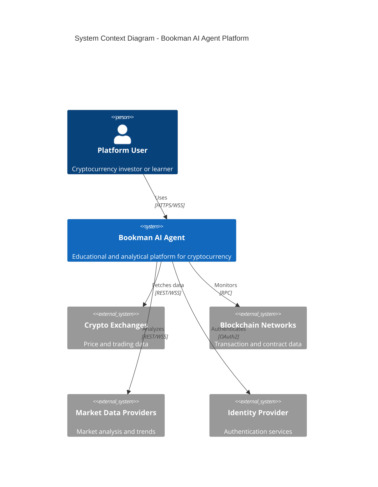

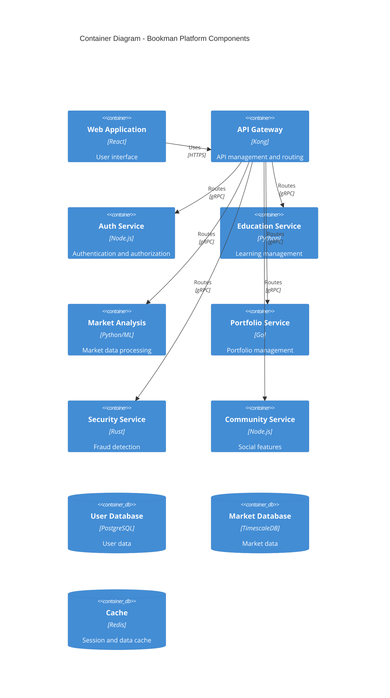

## 2.2 Component Details

| Component | Purpose | Technology Stack | Scaling Strategy |
|-----------|---------|-----------------|------------------|
| Web Frontend | User interface | React, TypeScript, Redux | Horizontal with CDN |
| API Gateway | Request routing | Kong, Nginx | Horizontal with load balancing |
| Education Service | Learning management | Python, FastAPI | Horizontal with state management |
| Market Analysis | Data processing | Python, TensorFlow | Vertical for ML workloads |
| Portfolio Service | Asset tracking | Go, gRPC | Horizontal with sharding |
| Security Service | Fraud detection | Rust, Tokio | Horizontal with event sourcing |
| Community Service | Social features | Node.js, Socket.io | Horizontal with pub/sub |

## 2.3 Technical Decisions

### Architecture Style
- Microservices architecture for:
  * Independent scaling
  * Technology flexibility
  * Fault isolation
  * Team autonomy

### Communication Patterns

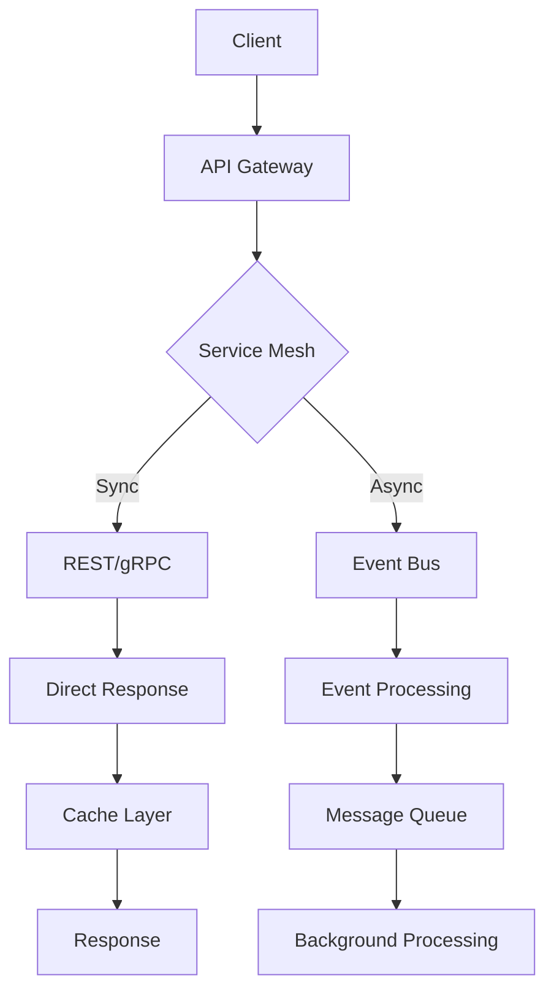

### Data Storage Solutions

| Data Type | Storage Solution | Justification |
|-----------|-----------------|---------------|
| User Data | PostgreSQL | ACID compliance, relational integrity |
| Market Data | TimescaleDB | Time-series optimization, scalability |
| Cache | Redis | In-memory performance, pub/sub support |
| Events | Apache Kafka | Stream processing, durability |
| Files | S3-compatible | Object storage, CDN integration |

## 2.4 Cross-Cutting Concerns

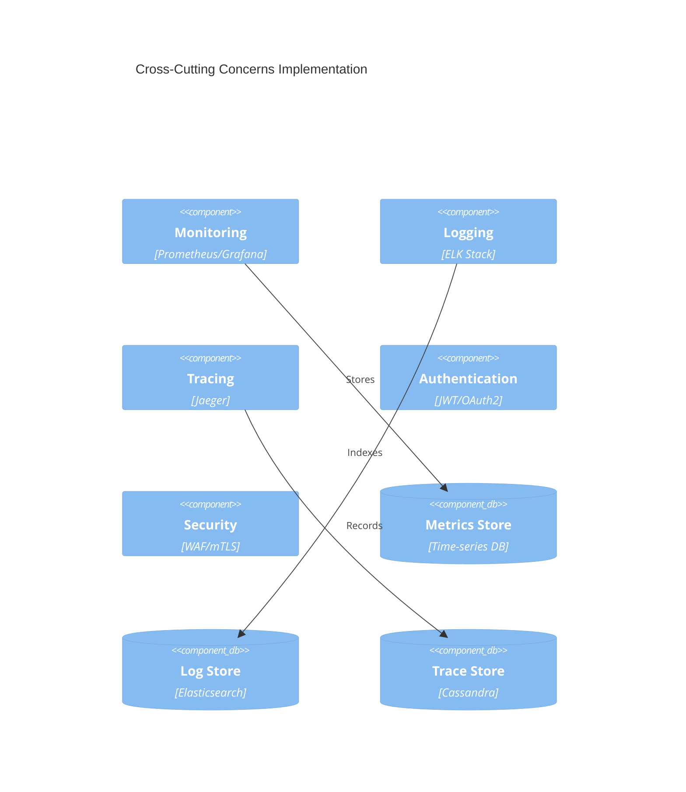

### Deployment Architecture

```mermaid
C4Deployment
    title Deployment Diagram - Production Environment

    Deployment_Node(cdn, "CDN", "CloudFront"){
        Container(static, "Static Assets")
    }
    
    Deployment_Node(k8s, "Kubernetes Cluster"){
        Container(services, "Microservices")
        Container(dbs, "Databases")
        Container(cache, "Cache Layer")
    }
    
    Deployment_Node(storage, "Object Storage"){
        Container(files, "User Files")
        Container(backups, "Backups")
    }
    
    Rel(cdn, k8s, "Routes traffic")
    Rel(k8s, storage, "Stores data")
```

### Data Flow Architecture

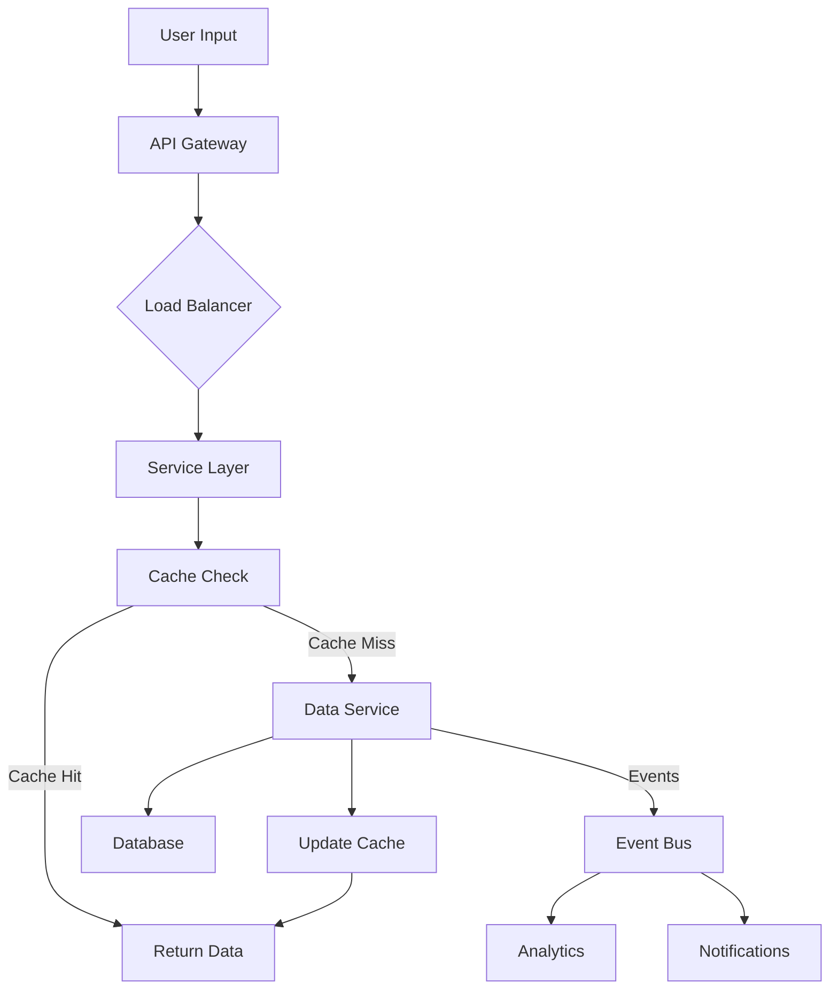

# 3. SYSTEM COMPONENTS ARCHITECTURE

## 3.1 USER INTERFACE DESIGN

### 3.1.1 Design System Specifications

| Component | Specification | Implementation |
|-----------|--------------|----------------|
| Typography | Roboto, Inter | Font sizes: 12-32px, Line height: 1.5 |
| Color Palette | Primary: #2563EB, Secondary: #10B981 | Accessible contrast ratios (WCAG 2.1 AA) |
| Spacing System | 4px base unit | Increments: 4, 8, 16, 24, 32, 48, 64px |
| Grid System | 12-column fluid grid | Breakpoints: 320px, 768px, 1024px, 1440px |
| Component Library | Material UI v5 | Custom themed components with brand styling |
| Dark Mode | Auto-switching based on system | Separate color tokens for dark/light themes |
| Accessibility | WCAG 2.1 Level AA | ARIA labels, keyboard navigation, screen readers |

### 3.1.2 Layout Structure

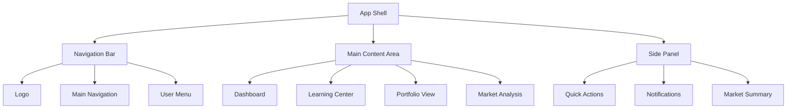

### 3.1.3 Critical User Flows

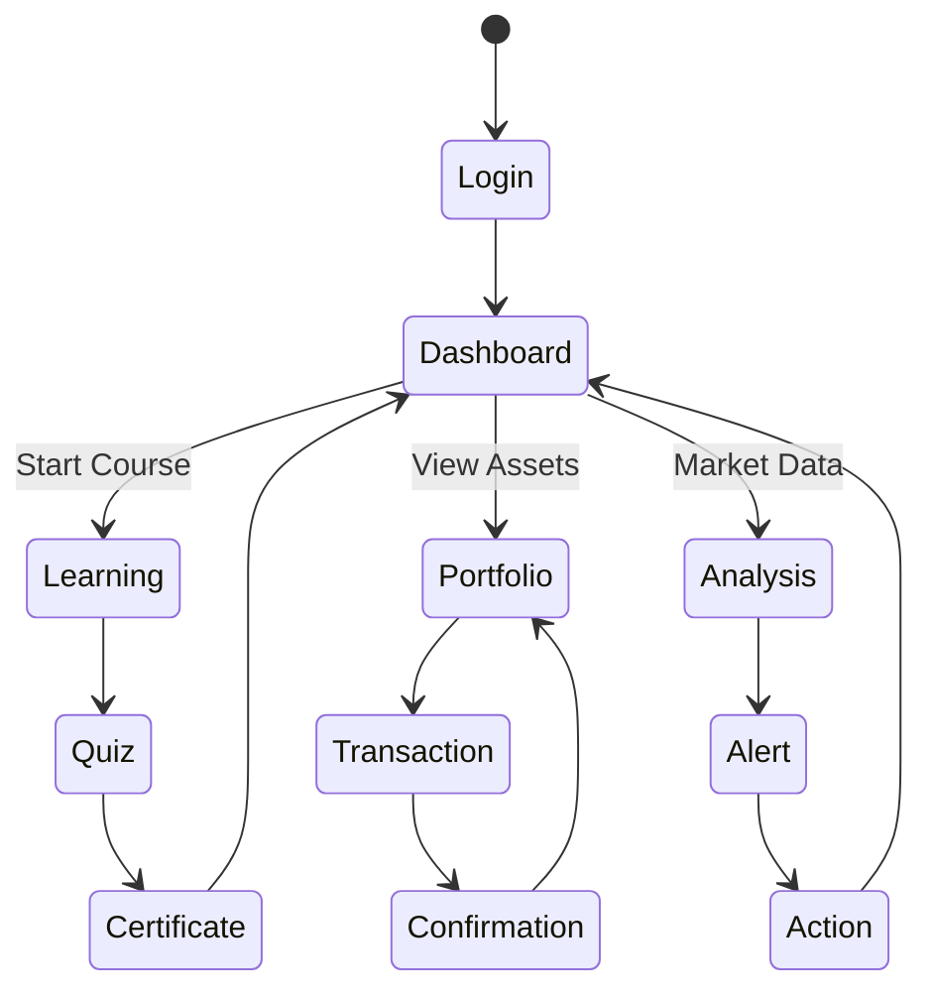

## 3.2 DATABASE DESIGN

### 3.2.1 Schema Design

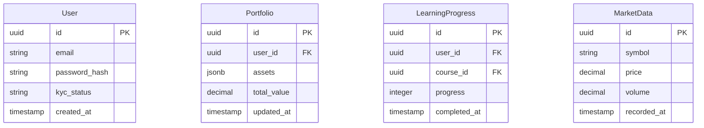

### 3.2.2 Data Management Strategy

| Aspect | Strategy | Implementation |
|--------|----------|----------------|
| Partitioning | Time-based partitioning for market data | Monthly partitions with range bounds |
| Indexing | B-tree indexes for lookups, GiST for spatial | Covering indexes for common queries |
| Replication | Multi-region active-passive | Async replication with 2 replicas |
| Backup | Continuous archiving | WAL archiving with point-in-time recovery |
| Retention | Tiered storage policy | Hot: 3 months, Warm: 1 year, Cold: 7 years |
| Encryption | Column-level encryption | AES-256 for sensitive data |

## 3.3 API DESIGN

### 3.3.1 API Architecture

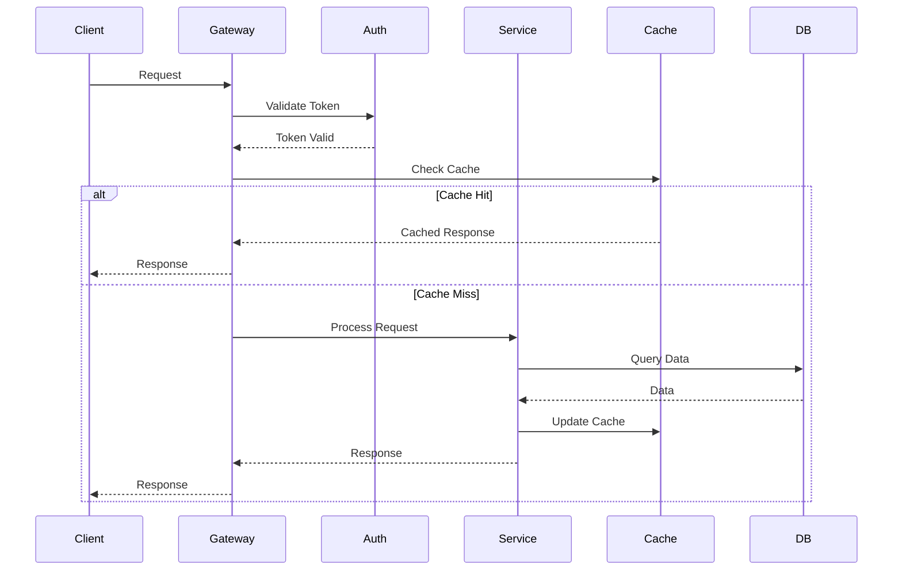

### 3.3.2 API Specifications

| Endpoint Category | Authentication | Rate Limit | Cache TTL |
|------------------|----------------|------------|-----------|
| Public Market Data | None | 100/min | 60s |
| User Data | JWT Bearer | 300/min | No cache |
| Portfolio Actions | JWT + 2FA | 50/min | No cache |
| Learning Content | JWT Bearer | 200/min | 3600s |
| Trading Analytics | JWT Bearer | 150/min | 300s |

### 3.3.3 Integration Patterns

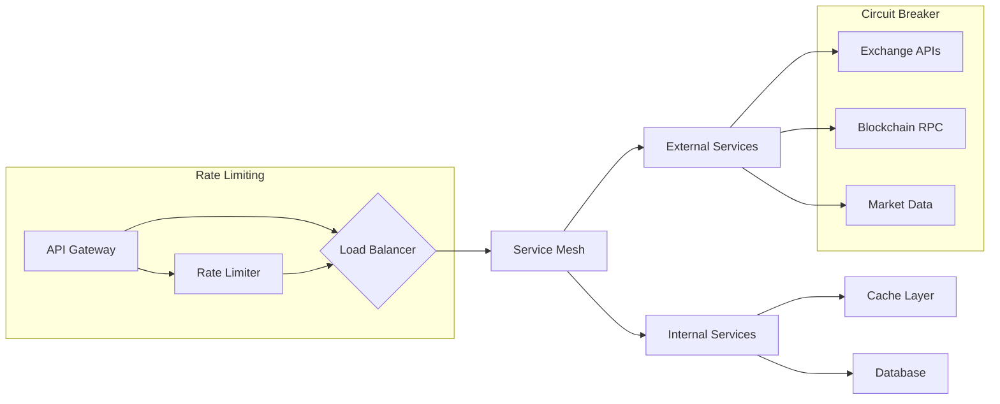

# 4. TECHNOLOGY STACK

## 4.1 PROGRAMMING LANGUAGES

| Platform/Component | Language | Version | Justification |
|-------------------|----------|---------|---------------|
| Frontend Web | TypeScript | 5.0+ | Type safety, developer productivity, React ecosystem compatibility |
| Backend Services | Python, Go, Rust | Python 3.11+, Go 1.21+, Rust 1.70+ | Python for ML/AI, Go for performance-critical services, Rust for security components |
| Smart Contracts | Solidity | 0.8+ | Industry standard for blockchain integration |
| Data Processing | Python | 3.11+ | Rich ecosystem for data analysis and ML |
| DevOps Scripts | Python, Shell | Python 3.11+, Bash 5+ | Automation and infrastructure management |

## 4.2 FRAMEWORKS & LIBRARIES

### Core Frameworks

| Component | Framework | Version | Justification |
|-----------|-----------|---------|---------------|
| Frontend | React | 18.2+ | Component reusability, virtual DOM performance |
| UI Components | Material UI | 5.0+ | Comprehensive component library, customization |
| API Gateway | Kong | 3.0+ | Enterprise-grade API management |
| Backend Services | FastAPI, Gin, Actix | FastAPI 0.100+, Gin 1.9+, Actix 4+ | High performance, async support |
| ML/AI | TensorFlow, PyTorch | TF 2.13+, PyTorch 2.0+ | Comprehensive ML capabilities |
| Testing | Jest, PyTest | Jest 29+, PyTest 7+ | Robust testing frameworks |

### Supporting Libraries

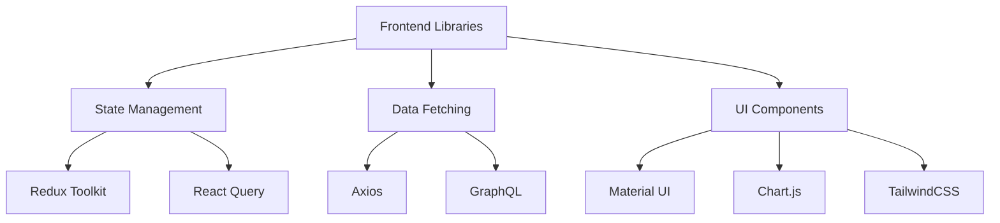

## 4.3 DATABASES & STORAGE

| Type | Technology | Version | Purpose |
|------|------------|---------|----------|
| Primary Database | PostgreSQL | 15+ | User data, transactions |
| Time-series Data | TimescaleDB | 2.11+ | Market data, analytics |
| Cache Layer | Redis | 7.0+ | Session data, real-time features |
| Document Store | MongoDB | 6.0+ | Unstructured content |
| Search Engine | Elasticsearch | 8.0+ | Full-text search |
| Object Storage | S3-compatible | - | Media, backups |

### Data Flow Architecture

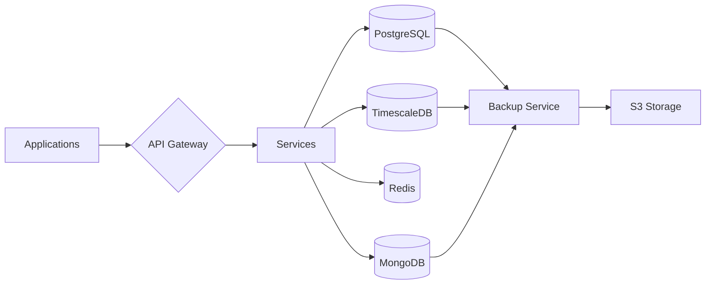

## 4.4 THIRD-PARTY SERVICES

| Category | Service | Purpose | Integration Method |
|----------|---------|---------|-------------------|
| Authentication | Auth0 | User authentication | OAuth2/OIDC |
| Market Data | CoinGecko, Binance | Crypto pricing | REST API |
| Blockchain | Infura, Alchemy | Network access | JSON-RPC |
| Email | SendGrid | Notifications | SMTP/API |
| Monitoring | Datadog | System monitoring | Agent/API |
| CDN | Cloudflare | Content delivery | DNS/API |

## 4.5 DEVELOPMENT & DEPLOYMENT

### Development Tools

| Category | Tool | Version | Purpose |
|----------|------|---------|----------|
| IDE | VSCode | Latest | Development environment |
| Version Control | Git | 2.40+ | Source control |
| API Testing | Postman | Latest | API development |
| Documentation | Swagger | OpenAPI 3.0 | API documentation |
| Code Quality | SonarQube | 9.0+ | Code analysis |

### Deployment Pipeline

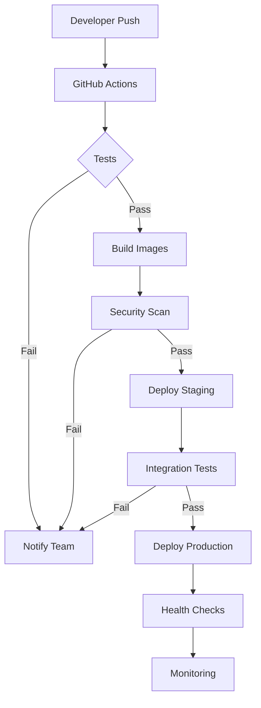

### Infrastructure Architecture

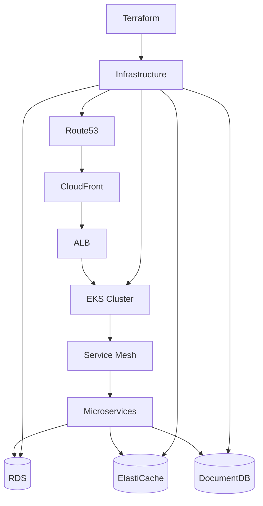

# 5. SYSTEM DESIGN

## 5.1 USER INTERFACE DESIGN

### 5.1.1 Layout Structure

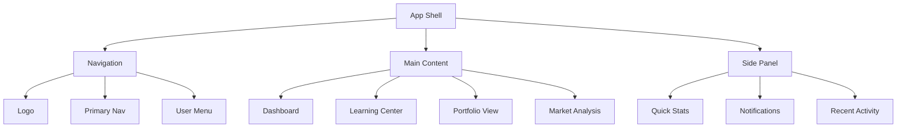

### 5.1.2 Component Specifications

| Component | Description | Interaction Pattern |
|-----------|-------------|-------------------|
| Navigation Bar | Fixed top bar with primary navigation | Sticky header with dropdown menus |
| Dashboard | Grid layout with customizable widgets | Drag-and-drop card arrangement |
| Learning Center | Masonry grid of course modules | Progressive disclosure of content |
| Portfolio View | Multi-panel asset overview | Interactive charts with drill-down |
| Market Analysis | Real-time data visualization | Dynamic filtering and timeframes |

### 5.1.3 Responsive Breakpoints

| Breakpoint | Layout Changes | Component Behavior |
|------------|----------------|-------------------|
| Mobile (<768px) | Single column, collapsed nav | Stacked cards, simplified charts |
| Tablet (768-1024px) | Two column, expanded nav | Grid layout, basic charts |
| Desktop (>1024px) | Three column, full nav | Full features, advanced charts |

## 5.2 DATABASE DESIGN

### 5.2.1 Schema Overview

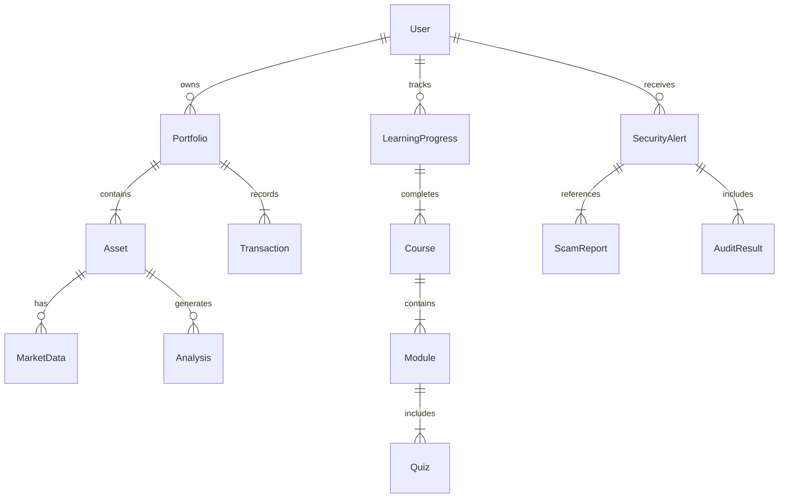

### 5.2.2 Table Specifications

| Table | Primary Key | Foreign Keys | Indexes | Partitioning |
|-------|-------------|--------------|---------|--------------|
| users | user_id | - | email, username | - |
| portfolios | portfolio_id | user_id | user_id, created_at | - |
| assets | asset_id | portfolio_id | symbol, type | - |
| market_data | data_id | asset_id | timestamp, symbol | By month |
| learning_progress | progress_id | user_id, course_id | completion_date | - |

### 5.2.3 Data Access Patterns

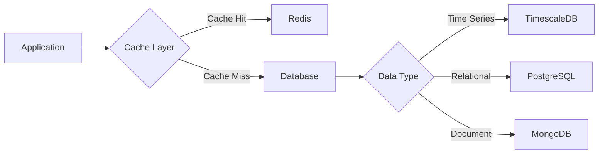

## 5.3 API DESIGN

### 5.3.1 API Architecture

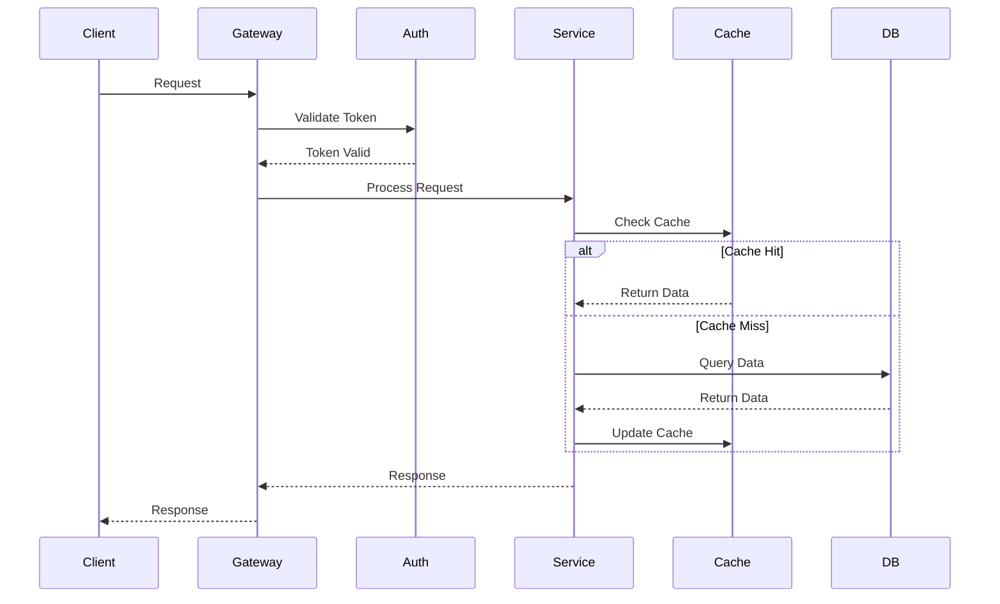

### 5.3.2 Endpoint Specifications

| Endpoint | Method | Authentication | Rate Limit | Cache TTL |
|----------|--------|----------------|------------|-----------|
| /api/v1/portfolio | GET | JWT | 100/min | 60s |
| /api/v1/market/data | GET | None | 1000/min | 5s |
| /api/v1/learning/progress | POST | JWT | 50/min | None |
| /api/v1/security/alerts | GET | JWT | 200/min | 30s |

### 5.3.3 Response Formats

| Response Type | Format | Compression | Pagination |
|--------------|--------|-------------|------------|
| Success | JSON | gzip | Cursor-based |
| Error | RFC7807 | gzip | - |
| Stream | Server-Sent Events | - | Time-based |
| Binary | Protocol Buffers | - | - |

### 5.3.4 Integration Patterns

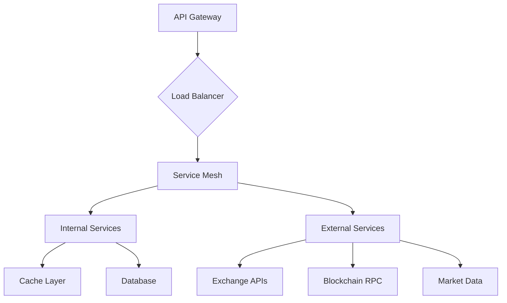

# 6. USER INTERFACE DESIGN

## 6.1 Design System

| Element | Specification | Usage |
|---------|--------------|--------|
| Typography | Roboto, Inter | Headers: 24-32px, Body: 14-16px |
| Colors | Primary: #2563EB, Secondary: #10B981 | Buttons, Icons, Accents |
| Spacing | Base unit: 8px | Margins, Padding: 8px, 16px, 24px, 32px |
| Breakpoints | Mobile: 320px, Tablet: 768px, Desktop: 1024px+ | Responsive layouts |
| Shadows | Light: 0 2px 4px rgba(0,0,0,0.1) | Cards, Modals, Dropdowns |

## 6.2 Core Wireframes

### 6.2.1 Dashboard Layout
```
+----------------------------------------------------------+
|  [#] Bookman AI    [@] Profile    [!] Alerts    [=] Menu  |
+----------------------------------------------------------+
|  +----------------+  +----------------------------------+ |
|  |  Navigation    |  |  Market Overview                 | |
|  |  [#] Dashboard |  |  BTC: $45,000 [====] +2.5%      | |
|  |  [@] Portfolio |  |  ETH: $3,200  [===]  +1.8%      | |
|  |  [?] Learn     |  |  +---------------------------+   | |
|  |  [$] Market    |  |  |  Price Chart             |   | |
|  |  [!] Security  |  |  |  [Line graph here]       |   | |
|  |  [*] Favorites |  |  +---------------------------+   | |
|  +----------------+  +----------------------------------+ |
|                                                          |
|  +-----------------+ +----------------+ +---------------+ |
|  | Learning Path    | | Portfolio      | | Security      | |
|  | [====] 65%       | | $25,000 Total  | | [✓] No Alerts | |
|  | Next: Smart      | | [Pie chart]    | | Last Scan:    | |
|  | Contracts        | |                | | 2h ago        | |
|  +-----------------+ +----------------+ +---------------+ |
+----------------------------------------------------------+
```

### 6.2.2 Learning Module Interface
```
+----------------------------------------------------------+
|  [<] Back to Courses    Module: Smart Contracts    [?]    |
+----------------------------------------------------------+
|  Progress: [=========>                ] 35%               |
|                                                          |
|  +--------------------------------------------------+   |
|  |  Video Content                                    |   |
|  |  +--------------------------------------------+  |   |
|  |  |                                            |  |   |
|  |  |           [Video Player]                   |  |   |
|  |  |                                            |  |   |
|  |  +--------------------------------------------+  |   |
|  |                                                  |   |
|  |  Key Concepts:                                   |   |
|  |  ( ) Smart Contract Basics                       |   |
|  |  (•) Contract Deployment                         |   |
|  |  ( ) Security Best Practices                     |   |
|  |                                                  |   |
|  |  [Previous]        [Save Progress]     [Next]    |   |
|  +--------------------------------------------------+   |
+----------------------------------------------------------+
```

### 6.2.3 Portfolio Tracker
```
+----------------------------------------------------------+
|  Portfolio Overview                     [+] Add Asset      |
+----------------------------------------------------------+
|  Total Value: $25,000                  [v] Filter         |
|                                                          |
|  +-------------------+  +--------------------------------+
|  |  Asset            |  |  Performance Chart             |
|  |  Distribution     |  |  +----------------------------+
|  |  [Pie Chart]      |  |  |                           |
|  |  BTC: 45%         |  |  |    [Area Chart]           |
|  |  ETH: 30%         |  |  |                           |
|  |  Others: 25%      |  |  |                           |
|  +-------------------+  +--------------------------------+
|                                                          |
|  Holdings                                                |
|  +--------------------------------------------------+   |
|  | Asset | Amount | Value    | 24h     | Actions     |   |
|  |-------|---------|----------|---------|------------|   |
|  | BTC   | 0.25    | $11,250  | +2.5%   | [v] More   |   |
|  | ETH   | 2.5     | $7,500   | +1.8%   | [v] More   |   |
|  +--------------------------------------------------+   |
+----------------------------------------------------------+
```

## 6.3 Component Legend

| Symbol | Meaning | Usage |
|--------|---------|-------|
| [#] | Dashboard icon | Main navigation |
| [@] | User/Profile | Account management |
| [!] | Alerts/Notifications | System messages |
| [=] | Settings/Menu | Configuration options |
| [?] | Help/Information | Context help |
| [$] | Financial/Market | Trading/portfolio features |
| [+] | Add/Create | New entries/assets |
| [<] | Back/Previous | Navigation |
| [v] | Dropdown menu | Selection options |
| [•] | Selected radio | Active choice |
| [✓] | Success/Complete | Verification |
| [====] | Progress bar | Completion status |

## 6.4 Interaction States

| Component | Default State | Hover State | Active State |
|-----------|--------------|-------------|--------------|
| Buttons | [Button] | [Button]* | [BUTTON] |
| Links | _link_ | _link_* | _LINK_ |
| Menu Items | [Item] | [Item]* | [ITEM] |
| Cards | +---+ | +===+ | +=!=+ |
| Inputs | [...] | [._.] | [___] |

## 6.5 Responsive Behavior

| Breakpoint | Layout Changes | Navigation |
|------------|----------------|------------|
| Mobile (<768px) | Stack all components vertically | Hamburger menu [≡] |
| Tablet (768-1024px) | 2-column grid for cards | Condensed navigation |
| Desktop (>1024px) | 3-column grid with sidebar | Full navigation bar |

# 7. SECURITY CONSIDERATIONS

## 7.1 AUTHENTICATION AND AUTHORIZATION

### Authentication Flow

```mermaid
sequenceDiagram
    participant User
    participant Frontend
    participant Auth Service
    participant OAuth Provider
    participant JWT Service
    participant User DB
    
    User->>Frontend: Login Request
    Frontend->>Auth Service: Forward Credentials
    Auth Service->>OAuth Provider: Verify Identity
    OAuth Provider-->>Auth Service: Identity Confirmed
    Auth Service->>JWT Service: Generate Tokens
    JWT Service-->>Auth Service: Access & Refresh Tokens
    Auth Service->>User DB: Log Session
    Auth Service-->>Frontend: Return Tokens
    Frontend-->>User: Login Success
```

### Authorization Matrix

| Role | Education | Portfolio | Market Data | Admin | Security Alerts |
|------|-----------|-----------|-------------|--------|-----------------|
| Guest | Read Basic | None | Read Public | None | None |
| User | Full Access | Own Portfolio | Full Access | None | Own Alerts |
| Premium | Full Access | Enhanced Tools | Real-time | None | Advanced Alerts |
| Admin | Manage | View All | Manage | Full | Manage All |
| Security | Read | None | None | Security Only | Full Access |

## 7.2 DATA SECURITY

### Encryption Standards

| Data Type | At Rest | In Transit | Key Management |
|-----------|----------|------------|----------------|
| User Credentials | AES-256 | TLS 1.3 | AWS KMS |
| Portfolio Data | AES-256 | TLS 1.3 | AWS KMS |
| Payment Info | AES-256 GCM | TLS 1.3 | PCI HSM |
| API Keys | AES-256 | mTLS | Vault |
| Session Data | AES-256 | TLS 1.3 | Redis TLS |

### Data Classification

```mermaid
graph TD
    A[Data Classification] --> B[Public]
    A --> C[Internal]
    A --> D[Confidential]
    A --> E[Restricted]
    
    B --> B1[Market Data]
    B --> B2[Educational Content]
    
    C --> C1[Analytics]
    C --> C2[System Logs]
    
    D --> D1[User Profiles]
    D --> D2[Portfolio Data]
    
    E --> E1[Credentials]
    E --> E2[Keys]
```

## 7.3 SECURITY PROTOCOLS

### Security Implementation

| Component | Protocol | Implementation |
|-----------|----------|----------------|
| API Gateway | OAuth 2.0 + JWT | Kong Gateway with rate limiting |
| Service Mesh | mTLS | Istio with automatic certificate rotation |
| Database | TDE | PostgreSQL with encryption at rest |
| Cache | Redis AUTH | Redis Enterprise with TLS |
| File Storage | Server-side encryption | S3 with KMS integration |
| Monitoring | Encrypted metrics | Prometheus with TLS |

### Security Monitoring

```mermaid
flowchart TD
    A[Security Events] --> B{SIEM}
    B --> C[Log Analysis]
    B --> D[Threat Detection]
    B --> E[Compliance Monitoring]
    
    C --> F[Alert Generation]
    D --> F
    E --> F
    
    F --> G[Security Team]
    F --> H[Automated Response]
    
    G --> I[Incident Management]
    H --> I
    
    I --> J[Resolution]
    I --> K[Documentation]
```

### Security Controls

| Control Type | Implementation | Monitoring |
|--------------|----------------|------------|
| Access Control | Role-based + MFA | Real-time audit logs |
| Network Security | WAF + DDoS protection | Traffic analysis |
| Application Security | Input validation + CSRF tokens | OWASP scanning |
| Data Security | Field-level encryption | Access monitoring |
| Infrastructure Security | Immutable infrastructure | Configuration drift detection |
| Incident Response | Automated + manual procedures | 24/7 SOC monitoring |

### Compliance Requirements

| Standard | Requirements | Implementation |
|----------|--------------|----------------|
| GDPR | Data privacy, user consent | Privacy by design, consent management |
| PCI DSS | Payment data security | Tokenization, secure transmission |
| SOC 2 | Security controls | Continuous monitoring, audit trails |
| ISO 27001 | Information security | ISMS implementation |
| CCPA | Data rights management | User data portal, deletion workflow |
| FinCEN | Transaction monitoring | AML checks, reporting system |

# 8. INFRASTRUCTURE

## 8.1 DEPLOYMENT ENVIRONMENT

| Environment | Purpose | Configuration | Scaling Strategy |
|-------------|---------|---------------|------------------|
| Development | Feature development, testing | Single region, minimal redundancy | Manual scaling |
| Staging | Pre-production testing | Multi-AZ, production mirror | Auto-scaling |
| Production | Live system | Multi-region, full redundancy | Auto-scaling |
| DR | Disaster recovery | Standby environment | Cross-region failover |

### Environment Architecture

```mermaid
flowchart TD
    A[Global DNS] --> B{CloudFront CDN}
    B --> C[Load Balancer]
    C --> D{Primary Region}
    C --> E{Secondary Region}
    
    D --> F[AZ-1]
    D --> G[AZ-2]
    D --> H[AZ-3]
    
    E --> I[AZ-1]
    E --> J[AZ-2]
    
    F & G & H --> K[(Primary DB)]
    I & J --> L[(Secondary DB)]
    
    K -.-> L
```

## 8.2 CLOUD SERVICES

| Service Category | AWS Service | Purpose | Configuration |
|-----------------|-------------|---------|---------------|
| Compute | EKS, EC2 | Container orchestration, VM instances | Production: r6g.xlarge |
| Storage | S3, EBS | Object storage, Block storage | S3: Standard-IA, EBS: gp3 |
| Database | RDS, ElastiCache | Relational DB, Caching | RDS: r6g.2xlarge, Redis: r6g.large |
| Networking | VPC, Route53 | Network isolation, DNS | Multi-AZ VPC, Latency routing |
| Security | WAF, Shield | DDoS protection, Web firewall | Enterprise protection |
| Monitoring | CloudWatch, X-Ray | Metrics, Tracing | Enhanced monitoring |

## 8.3 CONTAINERIZATION

### Container Strategy

```mermaid
graph TD
    A[Base Images] --> B{Service Images}
    B --> C[Frontend]
    B --> D[Backend Services]
    B --> E[Data Services]
    
    C --> F[Nginx]
    D --> G[Node.js]
    D --> H[Python]
    D --> I[Go]
    E --> J[PostgreSQL]
    E --> K[Redis]
    
    F & G & H & I & J & K --> L[Container Registry]
```

| Component | Base Image | Size Optimization | Security Measures |
|-----------|------------|-------------------|-------------------|
| Frontend | nginx:alpine | Multi-stage builds | Non-root user |
| Backend | node:18-alpine | Layer optimization | Minimal base image |
| ML Services | python:3.11-slim | Dependency pruning | Security scanning |
| Data Services | postgres:15-alpine | Volume mounting | Read-only filesystem |

## 8.4 ORCHESTRATION

### Kubernetes Architecture

```mermaid
graph TD
    A[EKS Control Plane] --> B{Node Groups}
    B --> C[Application Nodes]
    B --> D[Processing Nodes]
    B --> E[Database Nodes]
    
    C --> F[Frontend Pods]
    C --> G[Backend Pods]
    D --> H[ML Pods]
    D --> I[Analytics Pods]
    E --> J[StatefulSet Pods]
    
    K[Ingress Controller] --> F
    K --> G
```

| Component | Configuration | Scaling Policy | Resource Limits |
|-----------|---------------|----------------|-----------------|
| Frontend | Deployment | HPA: CPU 70% | 1CPU, 2GB RAM |
| Backend | Deployment | HPA: Custom metrics | 2CPU, 4GB RAM |
| ML Services | StatefulSet | Manual scaling | 4CPU, 8GB RAM |
| Databases | StatefulSet | Manual scaling | 4CPU, 16GB RAM |

## 8.5 CI/CD PIPELINE

### Pipeline Architecture

```mermaid
flowchart LR
    A[Source Code] --> B{GitHub Actions}
    B --> C[Build]
    C --> D[Test]
    D --> E[Security Scan]
    E --> F[Package]
    F --> G[Deploy]
    
    G --> H[Development]
    H --> I[Staging]
    I --> J[Production]
    
    K[Quality Gates] --> H
    K --> I
    K --> J
```

| Stage | Tools | Actions | Success Criteria |
|-------|-------|---------|------------------|
| Build | Docker | Multi-stage builds | Build success |
| Test | Jest, PyTest | Unit, Integration tests | 90% coverage |
| Security | Snyk, SonarQube | Vulnerability scanning | Zero high severity |
| Package | ECR | Container image creation | Image scan pass |
| Deploy | ArgoCD | GitOps deployment | Health checks pass |

### Deployment Strategy

| Environment | Strategy | Rollback Plan | Monitoring |
|-------------|----------|---------------|------------|
| Development | Direct deployment | Manual revert | Basic health checks |
| Staging | Blue/Green | Automated rollback | Full monitoring |
| Production | Canary | Automated rollback | Advanced monitoring |

# 9. APPENDICES

## 9.1 ADDITIONAL TECHNICAL INFORMATION

### Development Environment Setup

| Component | Tool | Version | Purpose |
|-----------|------|---------|----------|
| IDE | VSCode | 1.80+ | Primary development environment |
| Version Control | Git | 2.40+ | Source code management |
| Container Runtime | Docker | 24.0+ | Local development containers |
| Package Manager | npm/yarn | 9.0+/4.0+ | Frontend dependency management |
| API Testing | Postman | Latest | API development and testing |
| Database Tools | DBeaver | 23.0+ | Database management |

### Code Quality Standards

```mermaid
flowchart TD
    A[Code Quality Gates] --> B{Static Analysis}
    B --> C[ESLint]
    B --> D[SonarQube]
    B --> E[TypeScript Checks]
    
    A --> F{Testing}
    F --> G[Unit Tests]
    F --> H[Integration Tests]
    F --> I[E2E Tests]
    
    A --> J{Security}
    J --> K[SAST]
    J --> L[DAST]
    J --> M[Dependency Scanning]
    
    C & D & E --> N[Quality Reports]
    G & H & I --> O[Test Coverage]
    K & L & M --> P[Security Reports]
```

## 9.2 GLOSSARY

| Term | Definition |
|------|------------|
| Atomic Operation | Database operation that either completes entirely or fails completely |
| Circuit Breaker | Design pattern that prevents cascading failures in distributed systems |
| Content Delivery Network | Distributed network of servers that delivers content based on user location |
| Eventual Consistency | Database model where replicas become consistent over time |
| Hot-standby | Backup system that's ready to take over immediately |
| Immutable Infrastructure | Infrastructure that's never modified after deployment |
| Liquidity Pool | Collection of cryptocurrency funds locked in a smart contract |
| Merkle Tree | Data structure used for efficient verification of blockchain data |
| Sharding | Database partitioning that splits data across multiple servers |
| Zero-Knowledge Proof | Cryptographic method to prove knowledge without revealing information |

## 9.3 ACRONYMS

| Acronym | Full Form |
|---------|-----------|
| ACID | Atomicity, Consistency, Isolation, Durability |
| CORS | Cross-Origin Resource Sharing |
| CRUD | Create, Read, Update, Delete |
| DAST | Dynamic Application Security Testing |
| DDoS | Distributed Denial of Service |
| DNS | Domain Name System |
| E2E | End-to-End |
| ELK | Elasticsearch, Logstash, Kibana |
| gRPC | Google Remote Procedure Call |
| HSM | Hardware Security Module |
| IPFS | InterPlanetary File System |
| mTLS | Mutual Transport Layer Security |
| P2P | Peer-to-Peer |
| SAST | Static Application Security Testing |
| SDK | Software Development Kit |
| SLA | Service Level Agreement |
| SOC | Security Operations Center |
| SSOT | Single Source of Truth |
| VPC | Virtual Private Cloud |
| WAF | Web Application Firewall |
| WASM | WebAssembly |
| XSS | Cross-Site Scripting |

## 9.4 REFERENCE ARCHITECTURE

```mermaid
C4Context
    title Reference Architecture - Bookman AI Platform

    Person(user, "Platform User", "Cryptocurrency investor or learner")
    
    System_Boundary(platform, "Bookman AI Platform") {
        System(web, "Web Application", "React/TypeScript frontend")
        System(api, "API Gateway", "Kong Gateway")
        System(core, "Core Services", "Microservices")
        System(ml, "ML Engine", "TensorFlow/PyTorch")
        System(data, "Data Layer", "PostgreSQL/TimescaleDB")
    }
    
    System_Ext(exchange, "Crypto Exchanges", "Market data")
    System_Ext(blockchain, "Blockchain Networks", "Network data")
    System_Ext(auth, "Auth Provider", "Authentication")
    
    Rel(user, web, "Uses", "HTTPS")
    Rel(web, api, "Calls", "REST/WSS")
    Rel(api, core, "Routes", "gRPC")
    Rel(core, ml, "Analyzes", "gRPC")
    Rel(core, data, "Stores", "SQL")
    Rel(core, exchange, "Fetches", "REST")
    Rel(core, blockchain, "Monitors", "RPC")
    Rel(api, auth, "Verifies", "OAuth2")
```