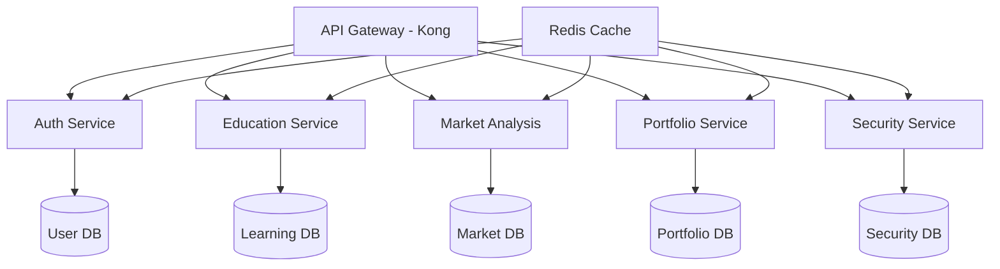
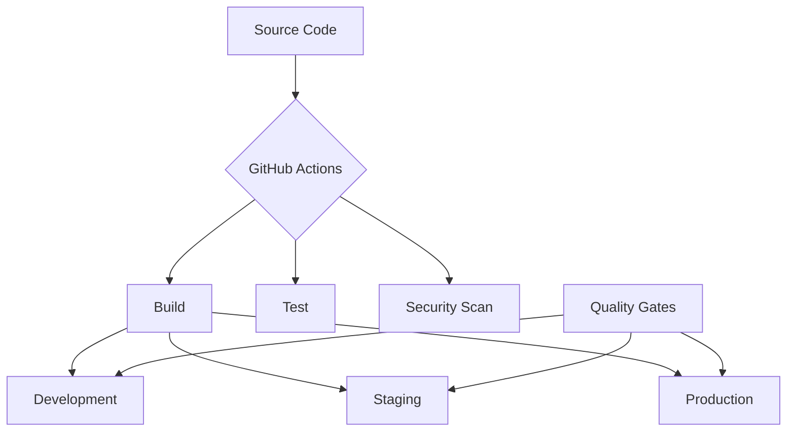
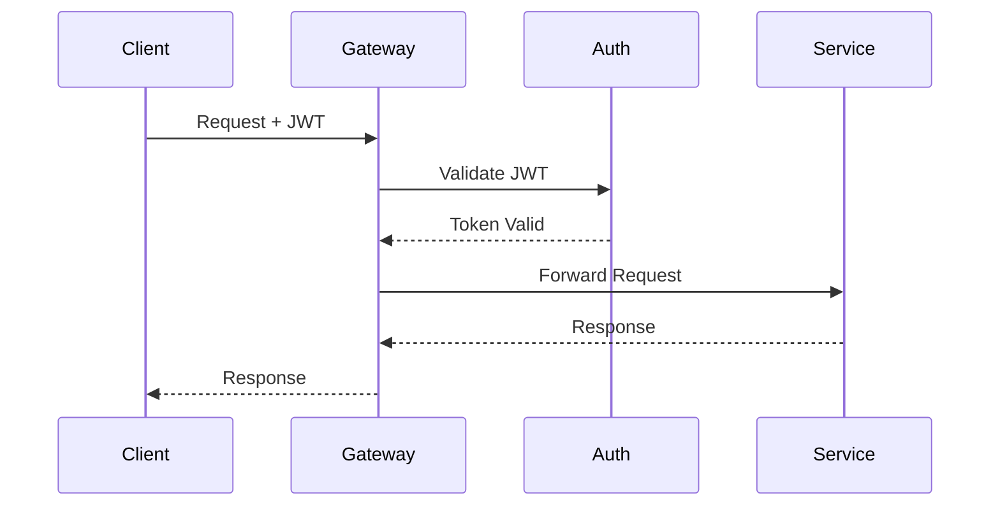

# Bookman AI Platform - Backend Documentation

## Overview

Bookman AI is a comprehensive cryptocurrency education and investment platform built on a modern microservices architecture. This documentation provides detailed information about the backend infrastructure, development procedures, and deployment processes.

### System Architecture



### Technology Stack

- **API Gateway**: Kong Gateway 3.0+
- **Services**:
  - Node.js 18+ (Auth, Community)
  - Python 3.11+ (Education, Market Analysis)
  - Go 1.21+ (Portfolio)
  - Rust 1.70+ (Security)
- **Databases**:
  - PostgreSQL 15+
  - TimescaleDB 2.11+
  - Redis 7.0+
- **Infrastructure**: Kubernetes 1.27+

## Prerequisites

### Required Software

| Software | Version | Purpose |
|----------|---------|---------|
| Docker | 24.0+ | Containerization |
| Docker Compose | 2.20+ | Local development |
| Node.js | 18.0+ | JavaScript runtime |
| Python | 3.11+ | Python services |
| Go | 1.21+ | Go services |
| Rust | 1.70+ | Security services |
| kubectl | 1.27+ | Kubernetes CLI |
| helm | 3.12+ | Kubernetes package manager |

## Getting Started

### Environment Setup

1. Clone the repository:
```bash
git clone git@github.com:bookman/backend.git
cd backend
```

2. Copy environment template:
```bash
cp .env.example .env
```

3. Configure environment variables:
```bash
# Required environment variables
POSTGRES_HOST=localhost
POSTGRES_PORT=5432
POSTGRES_USER=bookman
POSTGRES_PASSWORD=<secure-password>
REDIS_HOST=localhost
REDIS_PORT=6379
JWT_SECRET=<jwt-secret>
```

### Local Development

1. Start development environment:
```bash
docker-compose up -d
```

2. Verify services:
```bash
docker-compose ps
```

### Service Ports

| Service | Port | Health Check |
|---------|------|--------------|
| API Gateway | 8000 | /health |
| Auth Service | 3000 | /auth/health |
| Education Service | 3001 | /education/health |
| Market Analysis | 3002 | /market/health |
| Portfolio Service | 3003 | /portfolio/health |
| Security Service | 3004 | /security/health |

## Development Guidelines

### Code Standards

- **TypeScript/Node.js**:
  - ESLint configuration
  - Prettier formatting
  - Jest for testing
  
- **Python**:
  - Black formatter
  - pylint
  - pytest
  
- **Go**:
  - gofmt
  - golangci-lint
  - go test
  
- **Rust**:
  - rustfmt
  - clippy
  - cargo test

### Testing Requirements

| Test Type | Coverage | Tool |
|-----------|----------|------|
| Unit Tests | 90% | Service-specific |
| Integration Tests | 80% | Postman/Newman |
| E2E Tests | 70% | Cypress |
| Security Tests | 100% | OWASP ZAP |

## Deployment

### Environment Configuration



### Deployment Environments

| Environment | Purpose | Configuration | Scaling |
|-------------|---------|---------------|----------|
| Development | Local testing | docker-compose | Manual |
| Staging | Pre-production | k8s/staging/* | Auto-scaling |
| Production | Live system | k8s/production/* | Auto-scaling |

### Production Deployment

1. Build and push images:
```bash
make build-images
make push-images
```

2. Deploy to Kubernetes:
```bash
kubectl apply -f k8s/production/
```

3. Verify deployment:
```bash
kubectl get pods -n bookman
```

## Security

### Authentication Flow



### Security Measures

- OAuth 2.0 + JWT authentication
- mTLS for service communication
- Rate limiting at API Gateway
- Regular security scanning
- Automated vulnerability assessment
- Real-time threat monitoring

## Monitoring

### Metrics Collection

- Prometheus for metrics
- Grafana for visualization
- ELK Stack for logs
- Jaeger for tracing
- Custom alerting rules

### Health Checks

| Component | Endpoint | Frequency |
|-----------|----------|-----------|
| Services | /health | 30s |
| Database | TCP check | 60s |
| Cache | PING | 30s |
| API Gateway | /status | 30s |

## Support

- Documentation: `/docs`
- Issue Tracking: GitHub Issues
- Slack Channel: #bookman-backend
- Emergency Contact: ops@bookman.ai

## License

Copyright © 2023 Bookman AI. All rights reserved.